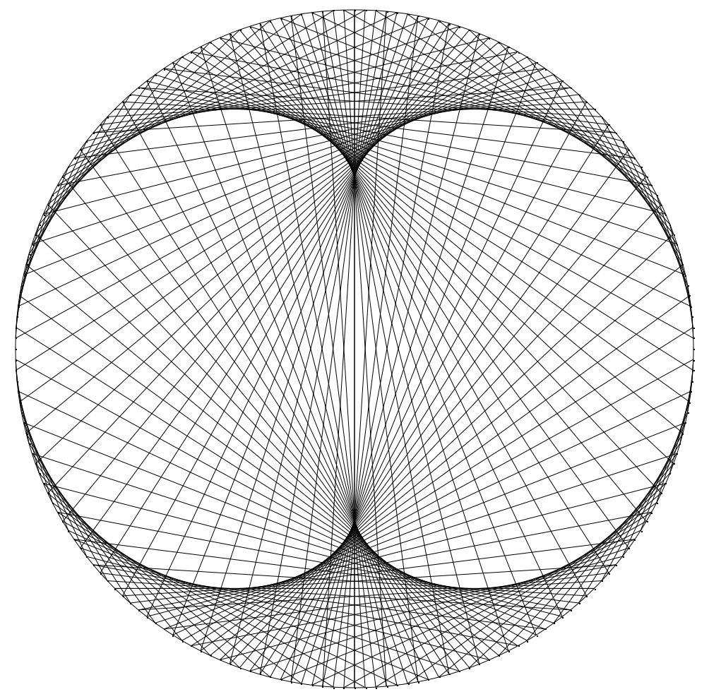
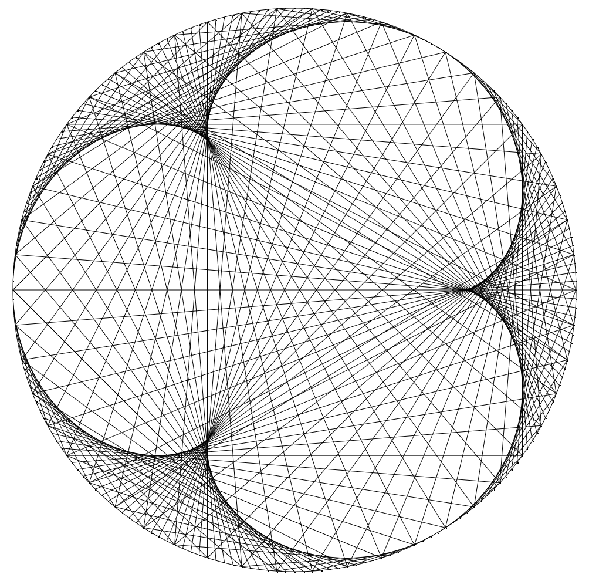

# Modular Multiplication On Circle

Visualization of modular multiplication & time tables on a circle using p5.js. Inspired by Mathologer's youtube video on timetables, which can be found [here.](https://www.youtube.com/watch?v=qhbuKbxJsk8) Some of the visualizations that were generated are seen below.

##### modular multiplication visualized as multiplication factor increases with time:

##### images  of a cardioid (multiplication factor: 2), nephroid (multiplication factor: 3), & time table with multiplication factor: 4:
 
